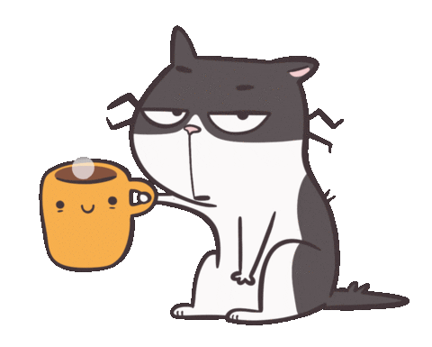
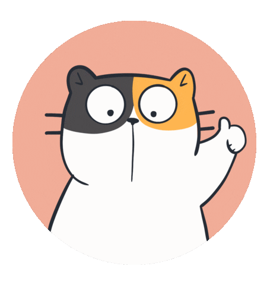
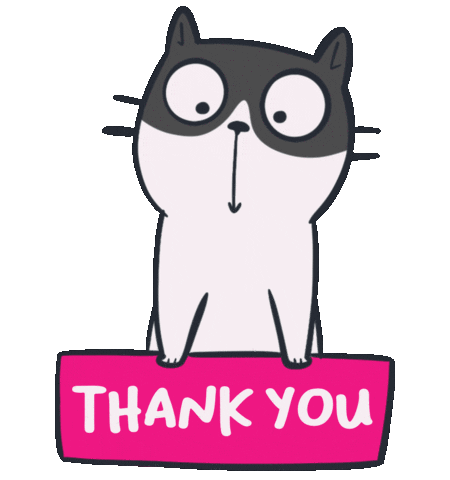

### <h1>  Hi there, I'm [Shenali!](https://github.com/Shenali-Madurapperuma/)</h1>

### <h6>    <em>A little more about me... </em></h6>
### 
### I'm a <em>Software Engineer 🛠</em> with the background of <em>UI/UX Design</em>, constantly exploring new techniques and trends.<br/> I graduated 🎓 from the <em>University of Sri Jayawardenepura with a B.Sc. in Physical Science</em>.<br/>And really passionate 💡 about <em>web development, fronend development, creative design, 3d animation and many more...</em><br/>Currently I am actively learning about web development tools & technologies starting from frontend development, to expand my skill set! 🚀

### 📫 Get in Touch:
Let's connect and collaborate! Feel free to reach out via email at shenalimadurapperuma@gmail.com or connect with me on [LinkedIn](https://www.linkedin.com/in/shenali-madurapperuma/).
<hr>

### <h6>    <em>My Tools & Technologies... </em></h6>

```javascript
const myTechStack = {
  hasExperience: {
    programmingLanguages: ["HTML", "CSS", "JavaScript", "Java", "Python", "C"],
    frameworksAndLibraries: {
      frontend: ["React.js"],
      uiFrameworks: ["Bootstrap", "Tailwind CSS", "MUI (Material-UI)"],
      animationAndMotionLibraries: ["Framer Motion", "Gsap (GreenSock Animation Platform)", "LottieFiles"],
      buildTools: ["Vite", "ESLint", "Prettier"],
      otherTools: ["npm (Node Package Manager)", "Chrome DevTools"]
    },
    versionControlAndIDEs: {
      versionControl: ["Git", "GitHub"],
      IDEs: ["VSCode (Visual Studio Code)", "NetBeans", "IntelliJ IDEA", "CodeBlocks"]
    },
    designTools: ["Figma", "Photoshop", "Illustrator", "Canva"],
  },
  stillLearning: [hasExperience, ...moreToolsAndTechnologies]
  }
};
// ? Error: moreToolsAndTechnologies not found
```
<hr>

### <h6 align="center"><em>Thank you for stopping by!</em><br/>Let's turn ideas into reality and create something that leave a lasting impac</h6>
### <div align="center"></div>


